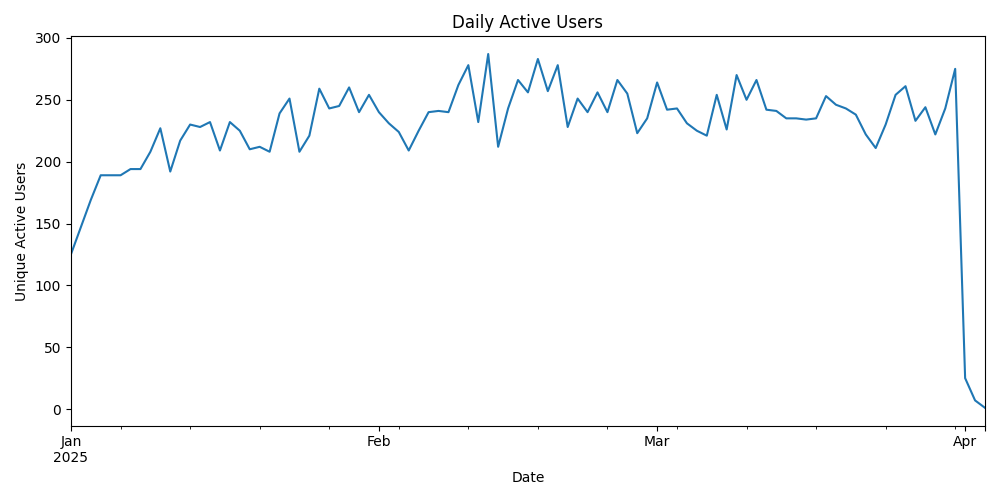
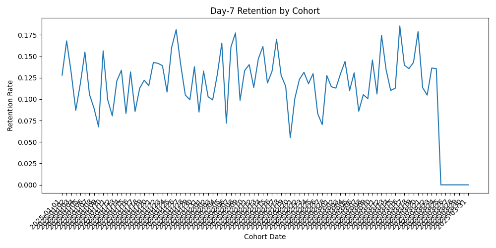
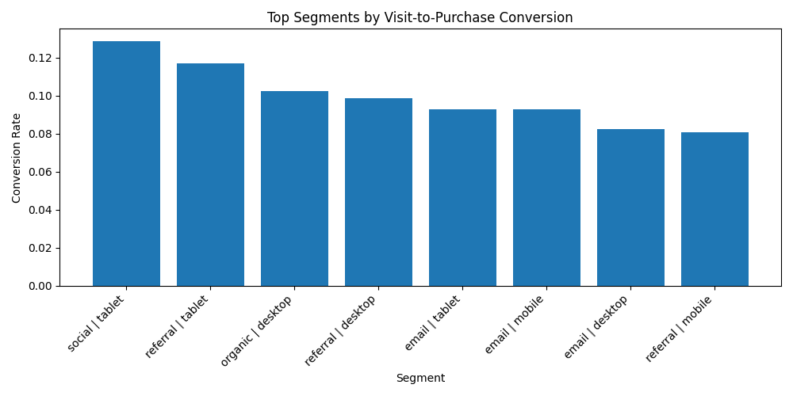

## Product Analytics: Funnel, Retention & A/B Testing

Built an end-to-end product analytics system to analyze user behavior across a simulated product funnel and evaluate growth opportunities.

- Identified **~60% variation in conversion performance across segments (8% → 13%)**
- Measured **Day-7 retention of ~10–15%**, indicating moderate engagement
- Analyzed stable engagement of **~220–270 daily active users (DAU)**
- Discovered high-performing segments such as **social | tablet (~13% conversion)**

This project simulates real-world product analytics workflows used to diagnose funnel drop-offs, measure retention, and evaluate product changes through experimentation.
---

## Business Objective

Modern product teams rely on data to answer critical questions:

* Where do users drop off in the product funnel?
* Which user segments convert or retain best?
* Does a product change meaningfully improve key metrics?
* Are there trade-offs between conversion and long-term retention?

This project simulates these scenarios and provides actionable insights using analytical methods.

---

## Key Analyses

### 1. Funnel Conversion Analysis

* Quantified user drop-offs across key product stages (e.g., visit → signup → activation → purchase)
* Identified highest-friction stages impacting conversion

### 2. Retention & Cohort Analysis

* Measured **Day-7 retention** across user cohorts
* Evaluated engagement trends over time
* Compared retention patterns across segments

### 3. A/B Testing (Experimentation)

* Simulated control vs treatment groups
* Measured lift in conversion metrics
* Performed statistical testing to assess significance

### 4. Segmentation Analysis

* Analyzed performance across user segments (e.g., channels, cohorts)
* Identified high-performing and underperforming segments

---

## Key Findings

- Daily Active Users (DAU) remained stable between **220–270 users**, indicating consistent engagement, with minor fluctuations likely driven by user behavior variability.

- Day-7 retention averaged approximately **10–15%**, indicating moderate engagement but room for improvement in long-term retention.

- Top-performing segment was **social | tablet (~13% conversion)**, followed by **referral | tablet (~11–12%)**, suggesting strong performance for tablet-based acquisition channels.

- Lower-performing segments such as **referral | mobile (~8%)** indicate potential UX or targeting inefficiencies.

- Segment-level variation (~8% → 13%) shows a **~60% relative difference in conversion**, highlighting the importance of targeted strategies.

- Funnel and KPI outputs suggest that **conversion bottlenecks and retention decay are the primary constraints on growth**.

- A sharp drop in recent DAU and retention metrics is observed due to incomplete data for the most recent cohorts, not an actual decline in user activity.

---

## Business Impact

- Improving onboarding and conversion bottlenecks could increase downstream purchases and overall funnel efficiency
- Prioritizing high-performing segments such as **social | tablet** and **referral | tablet** can improve acquisition ROI
- Addressing lower-performing segments like **referral | mobile** may recover lost conversions through UX or targeting improvements
- Retention remains modest at **~10–15%**, indicating that engagement improvements could meaningfully increase long-term user value

---

## Visual Insights

### Daily Active Users

Consistent DAU suggests stable engagement, with recent end-of-series decline caused by incomplete latest-period data.

### Day-7 Retention by Cohort

Day-7 retention remains modest across cohorts, highlighting an opportunity to improve early engagement.

### Top Segments by Visit-to-Purchase Conversion

Tablet users acquired through social and referral channels show the strongest conversion performance.

---

## Experiment Design & A/B Testing

This project simulates an A/B test to evaluate the impact of a product change on conversion.

- **Hypothesis:** The treatment improves visit-to-purchase conversion rate  
- **Primary Metric:** Conversion rate (visit → purchase)  
- **Control Conversion Rate:** ~40%  
- **Treatment Conversion Rate:** ~46%  
- **Observed Lift:** ~15%  

### Interpretation
- The treatment shows a **positive lift in conversion**, suggesting the product change improves user behavior
- Further validation would require statistical significance testing and confidence intervals
- Long-term impact should be evaluated using retention metrics to ensure no negative downstream effects

---

## Example SQL Analysis

The analyses in this project mirror SQL-based workflows commonly used in product analytics.

### Funnel Conversion

```sql
SELECT
  stage,
  COUNT(DISTINCT user_id) AS users,
  COUNT(DISTINCT user_id) * 1.0 /
    LAG(COUNT(DISTINCT user_id)) OVER (ORDER BY stage) AS conversion_rate
FROM events
GROUP BY stage;
```

---

## Project Structure

```
product_analytics_fang_project/
│
├── data/                  # Synthetic event data
├── notebooks/             # Analysis notebook (case study)
├── src/                   # Core analytics modules
│   ├── funnel.py
│   ├── retention.py
│   ├── ab_testing.py
│
├── scripts/               # Data generation scripts
├── outputs/               # Reports and visualizations
├── tests/                 # Unit tests
├── main.py                # End-to-end pipeline runner
├── requirements.txt
└── pytest.ini
```

---

## How to Run

```bash
# Create virtual environment
python3 -m venv .venv
source .venv/bin/activate

# Install dependencies
pip install -r requirements.txt

# Generate dataset
python scripts/generate_data.py

# Run full analytics pipeline
python main.py

# Run tests
pytest
```

---

## Outputs

The pipeline generates:

* Funnel conversion report
* Retention analysis report
* A/B testing experiment results
* KPI summary metrics
* Visualizations (conversion, retention, segmentation)

---

## Key Skills Demonstrated

* Product analytics (funnels, retention, cohorts)
* A/B testing and experimentation
* SQL-style analytical thinking
* Data pipeline design and modularization
* Data visualization and reporting
* Business-focused metric interpretation

---

## Limitations

* Uses synthetic data; real-world behavior may vary
* Simplified experiment assumptions (no interference or network effects)
* Retention measured over limited time horizon
* Does not include advanced causal inference methods (e.g., CUPED)

---

## Future Improvements

* Implement variance reduction techniques (CUPED)
* Add power analysis for experiment design
* Incorporate real-world datasets
* Build interactive dashboard (Tableau / Power BI)
* Extend segmentation to additional dimensions (device, geography)
* Add real-time analytics pipeline

---

## Business Recommendations (Example)

* Improve onboarding experience to reduce activation drop-off
* Target high-performing segments for growth optimization
* Validate experiment impact before full rollout
* Monitor retention to ensure no long-term negative effects

---

## Conclusion

This project demonstrates how data can be used to **analyze user behavior, evaluate product changes, and guide business decisions**, mirroring real-world workflows in product analytics and data science teams.
